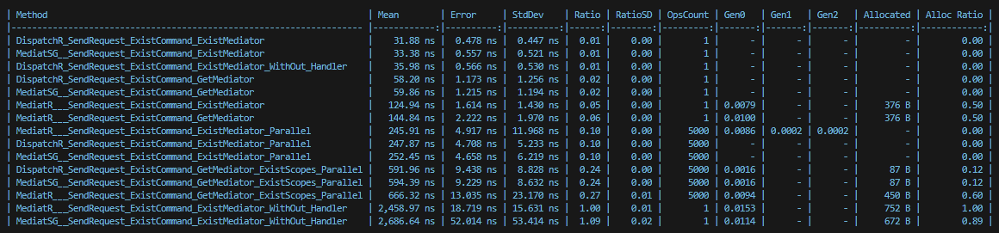
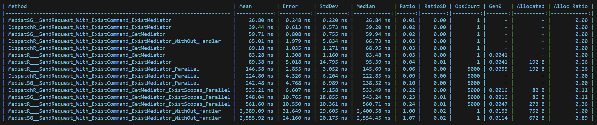
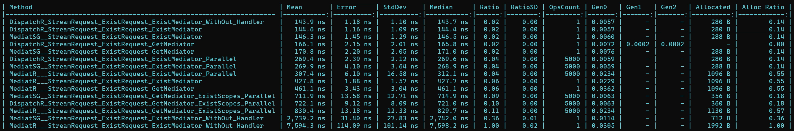
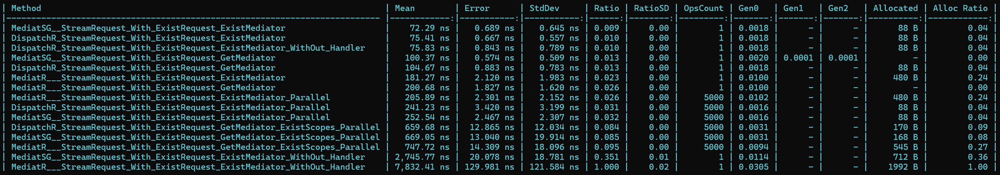
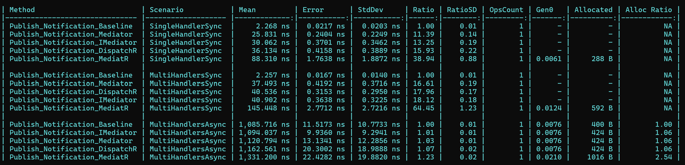

# DispatchR 🚀


[](https://www.nuget.org/packages/DispatchR.Mediator)
[](https://www.nuget.org/packages/DispatchR.Mediator)

### A High-Performance Mediator Implementation for .NET :trollface: 
** *Minimal memory footprint. Blazing-fast execution.* **

> [!NOTE]
> If you're curious to see the power of this library, [check out the benchmark](https://github.com/hasanxdev/DispatchR?tab=readme-ov-file#-bechmark-result) comparing MediatR vs Mediator Source Generator vs DispatchR.

## ⚡ Key Features
- Built entirely on top of Dependency Injection
- Zero runtime reflection after registration
- Choose your handler return type: `Task`, `ValueTask`, or `Synchronous Method`
- Allocates nothing on the heap — ideal for high-throughput scenarios
- Outperforms existing solutions in most real-world benchmarks
- Seamlessly compatible with MediatR — migrate with minimal effort
- Currently supports
  1. Simple Request:
     1. `IRequest<TRquest, TResponse>`
     2. `IRequestHandler<TRequest, TResponse>`
     3. `IPipelineBehavior<TRequest, TResponse>`
  2. Stream Request:
     1. `IStreamRequest<TRquest, TResponse>`
     2. `IStreamRequestHandler<TRequest, TResponse>`
     3. `IStreamPipelineBehavior<TRequest, TResponse>`
  3. Notifications:
     1. `INotification`
     2. `INotificationHandler<TRequestEvent>`
> :bulb: **Tip:** *If you're looking for a mediator with the raw performance of hand-written code, DispatchR is built for you.*

# Syntax Comparison: DispatchR vs MediatR

###### In the following, you will see the key differences and implementation details between MediatR and DispatchR.

## Request Definition

### MediatR
```csharp
public sealed class PingMediatR : IRequest<int> { }
```

### DispatchR
1. Sending `TRequest` to `IRequest`
2. Precise selection of output for both `async` and `sync` handlers 
   1. Ability to choose between `Task` and `ValueTask`

```csharp
public sealed class PingDispatchR : IRequest<PingDispatchR, ValueTask<int>> { } 
```

## Handler Definition

### MediatR
```csharp
public sealed class PingHandlerMediatR : IRequestHandler<PingMediatR, int>
{
    public Task<int> Handle(PingMediatR request, CancellationToken cancellationToken)
    {
        return Task.FromResult(0);
    }
}
```

### DispatchR (Don't change)

```csharp
public sealed class PingHandlerDispatchR : IRequestHandler<PingDispatchR, ValueTask<int>>
{
    public ValueTask<int> Handle(PingDispatchR request, CancellationToken cancellationToken)
    {
        return ValueTask.FromResult(0);
    }
}
```

## Pipeline Behavior

### MediatR
```csharp
public sealed class LoggingBehaviorMediat : IPipelineBehavior<PingMediatR, int>
{
    public Task<int> Handle(PingMediatR request, RequestHandlerDelegate<int> next, CancellationToken cancellationToken)
    {
        return next(cancellationToken);
    }
}
```

### DispatchR
1. Use ___Chain of Responsibility___ pattern

```csharp
public sealed class LoggingBehaviorDispatchR : IPipelineBehavior<PingDispatchR, ValueTask<int>>
{
    public required IRequestHandler<PingDispatchR, ValueTask<int>> NextPipeline { get; set; }

    public ValueTask<int> Handle(PingDispatchR request, CancellationToken cancellationToken)
    {
        return NextPipeline.Handle(request, cancellationToken);
    }
}
```

## Summary

- **DispatchR** lets the request itself define the return type.
- **No runtime reflection** in DispatchR — it's optimized for performance.
- **No static behavior chains** — pipelines are chained via DI and handler wiring.
- **Supports `void`, `Task`, or `ValueTask`** as return types.

Ideal for high-performance .NET applications.

## Stream Request Definition

### MediatR Stream
```csharp
public sealed class CounterStreamRequestMediatR : IStreamRequest<int> { }
```

### DispatchR
1. Sending `TRequest` to `IStreamRequest`

```csharp
public sealed class CounterStreamRequestDispatchR : IStreamRequest<PingDispatchR, ValueTask<int>> { } 
```

## Stream Handler Definition

### Stream Handler MediatR
```csharp
public sealed class CounterStreamHandlerMediatR : IStreamRequestHandler<CounterStreamRequestMediatR, int>
{
    public async IAsyncEnumerable<int> Handle(CounterStreamRequestMediatR request, CancellationToken cancellationToken)
    {
        yield return 1;
    }
}
```

### Stream Handler DispatchR (Don't change)

```csharp
public sealed class CounterStreamHandlerDispatchR : IStreamRequestHandler<CounterStreamHandlerDispatchR, int>
{
    public async IAsyncEnumerable<int> Handle(CounterStreamHandlerDispatchR request, CancellationToken cancellationToken)
    {
        yield return 1;
    }
}
```

## Stream Pipeline Behavior

### Stream Pipeline MediatR
```csharp
public sealed class CounterPipelineStreamHandler : IStreamPipelineBehavior<CounterStreamRequestMediatR, string>
{
    public async IAsyncEnumerable<string> Handle(CounterStreamRequestMediatR request, StreamHandlerDelegate<string> next, [EnumeratorCancellation] CancellationToken cancellationToken)
    {
        await foreach (var response in next().WithCancellation(cancellationToken).ConfigureAwait(false))
        {
            yield return response;
        }
    }
}
```

### Stream Pipeline DispatchR
1. Use ___Chain of Responsibility___ pattern

```csharp
public sealed class CounterPipelineStreamHandler : IStreamPipelineBehavior<CounterStreamRequestDispatchR, string>
{
    public required IStreamRequestHandler<CounterStreamRequestDispatchR, string> NextPipeline { get; set; }
    
    public async IAsyncEnumerable<string> Handle(CounterStreamRequestDispatchR request, [EnumeratorCancellation] CancellationToken cancellationToken)
    {
        await foreach (var response in NextPipeline.Handle(request, cancellationToken).ConfigureAwait(false))
        {
            yield return response;
        }
    }
}
```

------------
## Notification

### Notification MediatR
```csharp
public sealed record Event(Guid Id) : INotification;

public sealed class EventHandler(ILogger<Event> logger) : INotificationHandler<Event>
{
    public Task Handle(Event notification, CancellationToken cancellationToken)
    {
        logger.LogInformation("Received notification");
        return Task.CompletedTask;
    }
}
```

### Stream Pipeline DispatchR
1. Use ___ValueTask___

```csharp
public sealed record Event(Guid Id) : INotification;

public sealed class EventHandler(ILogger<Event> logger) : INotificationHandler<Event>
{
    public ValueTask Handle(Event notification, CancellationToken cancellationToken)
    {
        logger.LogInformation("Received notification");
        return ValueTask.CompletedTask;
    }
}
```

# ⚡ How DispatchR Achieves High Performance

###### DispatchR is designed with one goal in mind: **maximize performance with minimal memory usage**. Here's how it accomplishes that:

## What Happens Inside the `Send` Method?

```csharp
public TResponse Send<TRequest, TResponse>(IRequest<TRequest, TResponse> request,
    CancellationToken cancellationToken) where TRequest : class, IRequest, new()
{
    return serviceProvider
        .GetRequiredService<IRequestHandler<TRequest, TResponse>>()
        .Handle(Unsafe.As<TRequest>(request), cancellationToken);
}
```

## What Happens Inside the `CreateStream` Method?

```csharp
public IAsyncEnumerable<TResponse> CreateStream<TRequest, TResponse>(IStreamRequest<TRequest, TResponse> request, 
        CancellationToken cancellationToken) where TRequest : class, IStreamRequest, new()
{
    return serviceProvider.GetRequiredService<IStreamRequestHandler<TRequest, TResponse>>()
        .Handle(Unsafe.As<TRequest>(request), cancellationToken);
}
```
**Only the handler is resolved and directly invoked!**

## What Happens Inside the `Publish` Method?

```csharp
public async ValueTask Publish<TNotification>(TNotification request, CancellationToken cancellationToken) where TNotification : INotification
{
    var notificationsInDi = serviceProvider.GetRequiredService<IEnumerable<INotificationHandler<TNotification>>>();
    
    var notifications = Unsafe.As<INotificationHandler<TNotification>[]>(notificationsInDi);
    foreach (var notification in notifications)
    {
        var valueTask = notification.Handle(request, cancellationToken);
        if (valueTask.IsCompletedSuccessfully is false) // <-- Handle sync notifications
        {
            await valueTask;
        }
    }
}
```

But the real magic happens behind the scenes when DI resolves the handler dependency:
> 💡 __Tips:__ 
> 1. *We cache the handler using DI, so in scoped scenarios, the object is constructed only once and reused afterward.*
> 
> 2. *In terms of Dependency Injection (DI), everything in Requests is an IRequestHandler, it's just the keys that differ.
     When you request a specific key, a set of 1+N objects is returned: the first one is the actual handler, and the rest are the pipeline behaviors.*

```csharp
services.AddScoped(handlerInterface, sp =>
{
    var pipelinesWithHandler = Unsafe
        .As<IRequestHandler[]>(sp.GetKeyedServices<IRequestHandler>(key));
    
    IRequestHandler lastPipeline = pipelinesWithHandler[0];
    for (int i = 1; i < pipelinesWithHandler.Length; i++)
    {
        var pipeline = pipelinesWithHandler[i];
        pipeline.SetNext(lastPipeline);
        lastPipeline = pipeline;
    }

    return lastPipeline;
});
```

This elegant design chains pipeline behaviors at resolution time — no static lists, no reflection, no magic.

## 🪴 How to use?
It's simple! Just use the following code:
```csharp
builder.Services.AddDispatchR(typeof(MyCommand).Assembly, withPipelines: true, withNotifications: true);
```
This code will automatically register all pipelines by default. If you need to register them in a specific order, you can either add them manually or write your own reflection logic:
```csharp
builder.Services.AddDispatchR(typeof(MyCommand).Assembly, withPipelines: false, withNotifications: false);
builder.Services.AddScoped<IPipelineBehavior<MyCommand, int>, PipelineBehavior>();
builder.Services.AddScoped<IPipelineBehavior<MyCommand, int>, ValidationBehavior>();
builder.Services.AddScoped<IStreamPipelineBehavior<MyStreamCommand, int>, ValidationBehavior>();
builder.Services.AddScoped<INotificationHandler<Event>, EventHandler>();
```
### 💡 Key Notes:
1. Automatic pipeline and notification registration is enabled by default
2. Manual registration allows for custom pipeline or notification ordering
3. You can implement custom reflection if needed

## ✨ How to install?
```
dotnet add package DispatchR.Mediator --version 1.2.0
```

# 🧪 Bechmark Result:
> [!IMPORTANT]
> This benchmark was conducted using MediatR version 12.5.0 and the stable release of Mediator Source Generator, version 2.1.7.
Version 3 of Mediator Source Generator was excluded due to significantly lower performance.

### Send Request
#### 1. MediatR vs Mediator Source Generator vs DispatchR With Pipeline

#### 2. MediatR vs Mediator Source Generator vs DispatchR Without Pipeline


### Stream Request
#### 1. MediatR vs Mediator Source Generator vs DispatchR With Pipeline

#### 2. MediatR vs Mediator Source Generator vs DispatchR Without Pipeline


### Notification
#### 1. MediatR vs Mediator Source Generator vs DispatchR


## ✨ Contribute & Help Grow This Package! ✨
We welcome contributions to make this package even better! ❤️
 - Found a bug? → Open an issue
 - Have an idea? → Suggest a feature
 - Want to code? → Submit a PR

Let's build something amazing together! 🚀