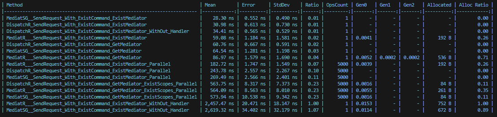

DispatchR 🚀
============

### A High-Performance Mediator Implementation for .NET
## 🔥 Features
- ⚡ faster than MediatR in benchmarks
- 🏗️ Zero-allocation architecture
- 🧩 Modular pipeline design
- 📦 MediatR compatible
- 🛠️ Built-in DI support

> [!IMPORTANT]
> This benchmark was conducted using MediatR version 12.5.0 and the stable release of Mediator Source Generator, version 2.1.7.
Version 3 of Mediator Source Generator was excluded due to significantly lower performance.

# Bechmark Result:
#### 1. MediatR vs Mediator Source Generator vs DispatchR With Pipeline

#### 2. MediatR vs Mediator Source Generator vs DispatchR Without Pipeline

